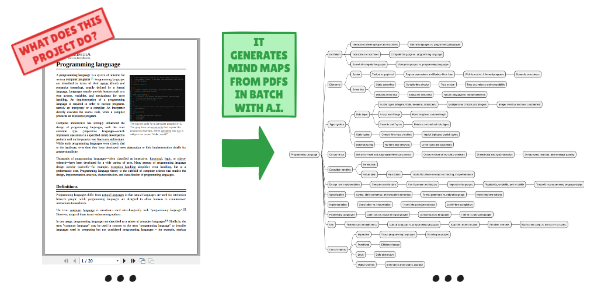

# Mind Map Generator

The Mind Map Generator allows you to automatically convert PDF files into mind maps in batches using Google's Generative AI (Gemini).

## Architecture overview

## 🔧 Installation 🪛

1. **Clone the repository:**
   
   - `git clone https://github.com/your-username/mind-map-generator.git`

   - `cd mind-map-generator`

1. **Install the dependencies:**
   
   - `pip install google-generativeai python-dotenv IPython`

1. **Configure the API key:**
   1. [Check here how you can create a key with a few clicks in Google AI Studio](https://ai.google.dev/gemini-api/docs/api-key#windows)
   1. Follow the instructions in the [`example_keys.env`](example_keys.env) file to set up your API key securely.

1. **Install Jupyter:**
    - [Check here how you can install Jupyter](https://jupyter.org/install)

1. **Ensure Java is installed.**

## 🎬 Usage 🪄

1. Place your PDF files in the folder 'inputs' of the repository 'mind-map-generator':

1. Run the Jupyter Notebook script to convert the PDFs into mind maps.

1. The generated mind maps will be saved in the output folder.

## 🤝 Contribution 

Currently, we are not able to work on external contributions.

## 🧑‍🤝‍🧑 Support and Community

[GitHub issues](https://github.com/diego-o-leite/assets/issues/)

## License

This project is licensed under the GNU General Public License v3.0.

See the [LICENSE](LICENSE) file for more details.